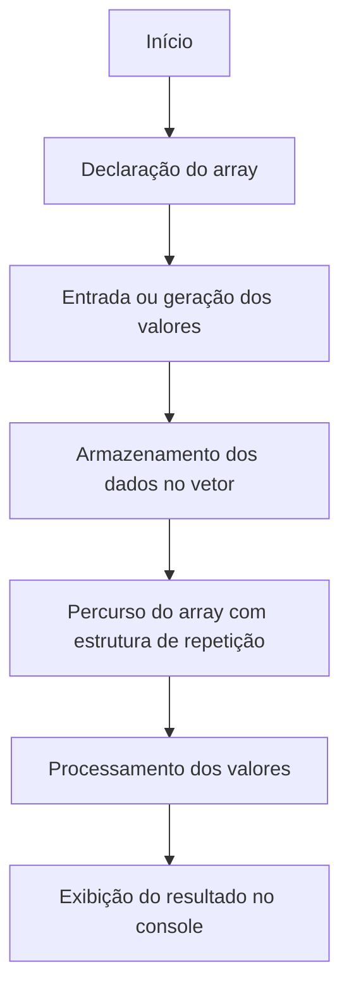
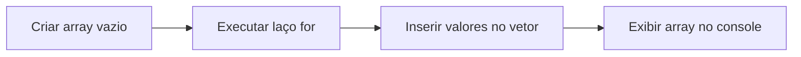
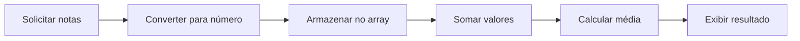

# JavaScript Array Iteration Fundamentals

<p align="left">
  
  
  
  
</p>

## Overview

Repositório com exercícios fundamentais em JavaScript voltados à manipulação de arrays, estruturas de repetição e operações numéricas básicas.

O projeto foi desenvolvido com foco na prática de lógica de programação, utilizando vetores para armazenar múltiplos valores, percorrer posições indexadas e realizar cálculos simples a partir dos dados armazenados.

## Technical Scope

| Área | Aplicação |
|---|---|
| Linguagem | JavaScript |
| Paradigma | Programação imperativa |
| Conceitos principais | Arrays, laços de repetição, índices e operações matemáticas |
| Entrada de dados | `prompt()` |
| Saída de dados | `console.log()` |
| Ambiente de execução | Navegador |

## Repository Structure

```text
javascript-array-iteration-fundamentals/
├── ex1.js
├── ex2.js
└── README.md
```

## Exercise Mapping

| Arquivo | Objetivo | Conceitos aplicados |
|---|---|---|
| `ex1.js` | Preencher automaticamente um vetor numérico | Array, índice, estrutura `for` |
| `ex2.js` | Armazenar notas e calcular média escolar | Array, `prompt`, `parseFloat`, soma acumulada e média |

## Logic Flow



## Implemented Concepts

### Array Initialization

Os exercícios utilizam arrays para armazenar múltiplos valores em uma única estrutura de dados.

```javascript
let numeros = [];
let notas = [];
```

### Indexed Iteration

A navegação pelos arrays é realizada com laços `for`, utilizando índices para acessar e modificar posições específicas.

```javascript
for (let index = 0; index < notas.length; index++) {
  somaNotas += notas[index];
}
```

### Numeric Processing

O projeto também pratica conversão de entrada textual para valores numéricos e cálculo de média aritmética.

```javascript
let nota = parseFloat(prompt("Digite a nota:"));
```

## Execution Flow by Exercise

### `ex1.js`



### `ex2.js`



## How to Run

Clone o repositório:

```bash
git clone https://github.com/iannxz/Atv_S1_R9.git
```

Acesse o diretório:

```bash
cd Atv_S1_R9
```

Como os exercícios utilizam `prompt()`, a execução recomendada é em ambiente de navegador.

Você pode executar os arquivos de duas formas:

### Opção 1 — Pelo navegador

Crie um arquivo `index.html` e importe o script desejado:

```html
<!DOCTYPE html>
<html lang="pt-BR">
<head>
  <meta charset="UTF-8">
  <title>JavaScript Array Iteration Fundamentals</title>
</head>
<body>
  <script src="ex2.js"></script>
</body>
</html>
```

Depois, abra o arquivo `index.html` no navegador.

### Opção 2 — Pelo console do navegador

Abra o DevTools do navegador, acesse a aba `Console` e execute o código manualmente.

## Learning Objectives

Ao finalizar os exercícios, são praticados os seguintes fundamentos:

| Competência | Descrição |
|---|---|
| Manipulação de arrays | Criação, preenchimento e leitura de vetores |
| Controle de fluxo | Uso de estruturas de repetição |
| Operações numéricas | Soma acumulada e cálculo de média |
| Entrada de dados | Captura de valores com `prompt()` |
| Debugging básico | Exibição de dados no console |

## Suggested Improvements

| Melhoria | Motivo |
|---|---|
| Substituir `prompt()` por entrada via HTML | Melhorar a experiência de uso |
| Criar validação para notas inválidas | Evitar valores vazios ou não numéricos |
| Separar lógica em funções | Melhorar organização e reutilização |
| Adicionar interface visual | Transformar o exercício em uma aplicação web simples |
| Padronizar nomes de variáveis | Melhorar legibilidade e manutenção do código |

## Project Classification

| Categoria | Informação |
|---|---|
| Tipo de projeto | Exercícios práticos |
| Nível | Fundamentos |
| Área | Lógica de programação |
| Linguagem principal | JavaScript |
| Foco técnico | Arrays, loops e operações numéricas |

## Status

Projeto finalizado para fins educacionais, com foco em fundamentos de lógica de programação utilizando JavaScript.
~~~~
